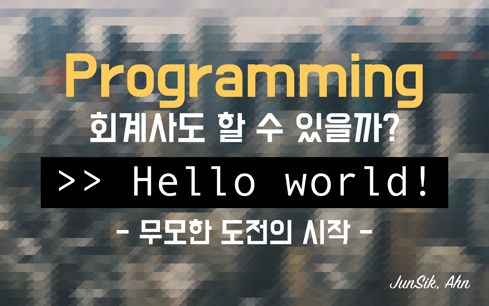

## 시작하며

### 기억력이 감퇴하는 나이

필자의 현재 나이는 서른다섯, 곧 있을 생일이 지나면 만으로 서른넷이라는 나이가 된다.
분명 2-3년 전까지만 해도, 머리가 꽤나 빠릿빠릿 돌아간다는 게 체감이 될 정도였지만, 지금은 전혀 그렇지 못하다.
오래지 않아 배웠거나 학습했던 것이 툭하면 기억이 안 나고, 특히 무언가 이른바 "체득"의 단계를 거치지 못한 새로운 배움을 기억의 저장소에서 꺼내온다는 것이 이다지도 어려운 일일 줄이야.

그래서 기록이 필요했다.

### 주된 관심사

필자의 이력은 다소 엉뚱하다.

2011년 한국공인회계사 자격증을 취득하여 약 5년간 회계법인에서 회계감사, 재무자문 등 회계사의 커리어를 쌓아오다가 퇴사를 했다.
그리고는 개발자의 길에 입문을 했다. 지금 돌이켜 생각해보면 참으로 용감하고 무쌍했던 결정이었다. 거의 매일 밤을 새다시피하며 독학으로 개발을 공부했다.
철저히 문과 베이스이기 때문에, 개발자라는 커리어는 한계점에 많이 부딪히고는 한다. 네트워크도 부족하고, 깊은 개념도 부족하고...
그렇지만 빠르게 변해가는 개발 환경의 흐름에 열심히 올라타고자 많은 노력을 하고 있다. 나름의 계획과 꿈을 하나하나 실천하고 실현하고자 노력하고 있고.

그렇게 지금은 `Ruby + Rails(ROR)`, `Vue.js + Nuxt.js`, `MySQL`, `AWS + Firebase(GCP)`, `NGINX` 정도를 주된 언어/프레임워크/개발환경 으로 익혀 사용중이다.  

### 기획의 방향과 흐름

지금 세상에는 수많은 회계사와 수많은 개발자들이 있다. 그리고 그들 모두 나름의 다양한 방식으로 업무를 하며 다양한 방식으로 우리의 삶에 맞닿아있다.  
필자 역시도 필자만의 방식으로 다양한 사람들의 삶에 맞닿아보기를 희망해본다.

그래서 이 블로그에는 필자의 주된 관심사와 관련한 주제의 포스팅을 남겨보고자 한다. 메모와 같은 방식으로.  
~~부디 지구의 유한한 자원을 낭비하는 배설의 장이 되지 않기를 희망해보며...~~

이 블로그의 주요한 카테고리는 우선 개발과 관련한 내용으로 가닥을 잡아보고자 한다. 여력이 된다면, 회계/세무/재무 등과 관련한 주제도 추가할 것이다.

지치지 않기를 바라며.  

2020.11.17.  
Junsik, Ahn.
